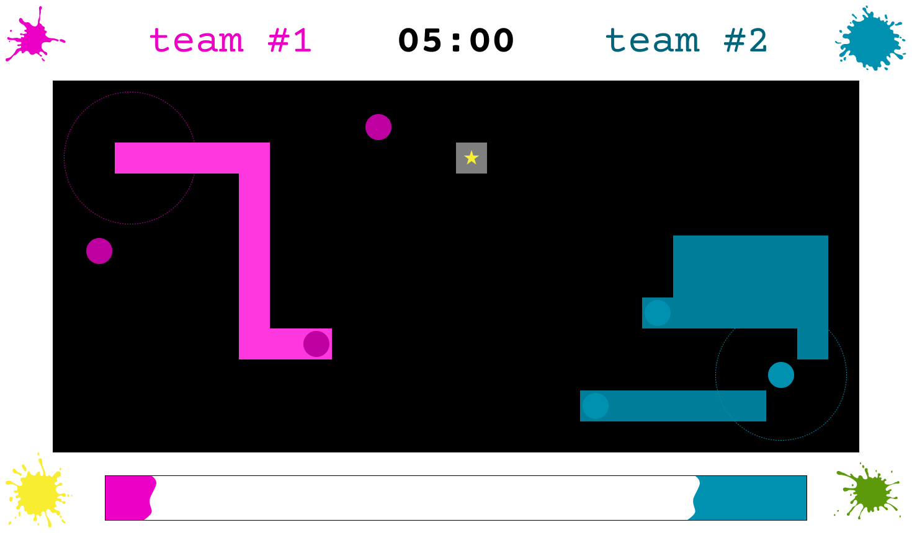

# SPYTHOON

## Le Splatoon® en Python

## Description

Spythoon est un jeu développé en Python, s'appuyant sur la librairie [PytactX par Jus de Lien](https://jusdeliens.com/). Il s'inspire du jeu vidéo Splatoon®.

Une équipe de 3 robots se défient sur une arène, dans l'objectif de recouvrir la plus grande surface de cette arène de la couleur de son équipe dans le temps imparti.

## Objectif du jeu

Recouvrir le plus de cases possibles de la couleur d'équipe en un temps donné.
_Taille du terrain : 12x26_

## Use Cases

### Capacités de l'agent du joueur

- Apparition dans l'arène, dans une zone d'équipe circulaire définie en amont par la carte
- Se déplacer sur la carte en relatif, en X et en Y, sur la direction du regard
- Pivoter sur lui-même dans les 4 directions : N, S, E, W
- Identifier si une case est "neutre" (= sans peinture) / Identifier si une case est recouverte de sa couleur ou de celle de l'adversaire. Identifie les cases sur une surface de 5x5 cases.
- Activer le spray pour colorer les cases
  - Lorsque on active le spray, toutes les cases sur lesquelles le robot passe se colorent de la couleur de l'équipe de manière permanente tant qu'un adversaire ne passe pas dessus
  - Lorsque le spray est activée, la vitesse de déplacement du robot est réduite
- Recouvrir les cases déjà couvertes par un adversaire lorsque l'agent arrive dessus
- il est possible de savoir quel agent se trouve dans notre range, et d'identifier si c'est un allié ou un ennemi

- Identifier des cases de "loot"
- Se déplacer vers des cases de "loot" de manière absolue en automatique, tout en gardant la possibilité d'intérompre le déplacement

- les cases de loots permettent d'avoir un boost temporaire de spray, modifiant la largeur du spray
